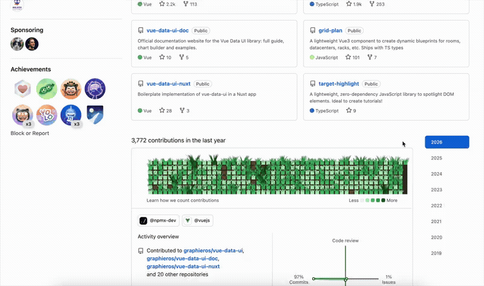

# Touch Grass

> A browser extension that turns GitHub contribution graphs into animated grass fields. Because sometimes you need to touch grass — even if it's digital.

Built during the [npmx recharging holiday](https://npmx.dev/recharging) — a week-long break (Feb 14-21) where the npmx community shut down to recover from the intense pace of building [npmx.dev](https://npmx.dev). After 160+ contributors, 1.1k+ commits, and 910+ PRs merged, the team earned a rest. Some of us recharged by a cosy fireplace. Others... built a Chrome extension about grass.

## What it does

- Replaces GitHub's contribution graph squares with animated grass
- The more you work, the tidier the grass — do too much, you get patches
- No contributions? Tall, lush dark green grass (you've been outside!)
- Heavy activity? Bare brown soil with tiny sprouts (busy coding!)
- Grass sways gently in the wind
- Mouse interaction bends the grass aside with spring-back physics
- Dark brown soil fills the grid background, no more white gaps
- Grass blades lean outward from each cell to fill gaps between squares
- Respects `prefers-reduced-motion` — renders static grass with no animation
- Tooltips still work — hover any cell to see the contribution count
- Supports GitHub dark mode and all themes

## Install

### Chrome

1. Download or clone this repo
2. Go to `chrome://extensions`
3. Enable **Developer mode**
4. Click **Load unpacked** and select the `touch-grass` directory

### Firefox

1. Download or clone this repo
2. Go to `about:debugging#/runtime/this-firefox`
3. Click **Load Temporary Add-on**
4. Select the `manifest.json` file

### Safari

1. Download or clone this repo
2. Run `xcrun safari-web-extension-converter /path/to/touch-grass --app-name "Touch Grass"`
3. Open the generated Xcode project, build, and enable the extension in Safari preferences

## See it in action

## How it works

A single content script (`content.js`) injected on `github.com/*`:

1. Finds the contribution graph (`.js-calendar-graph`)
2. Reads each cell's `data-level` (0-4) and computed background color
3. Creates a canvas overlay with headroom above the graph
4. Generates **tufts** — batched groups of grass blades drawn as compound paths
5. Animates with layered sine waves for organic wind sway
6. Tracks mouse position for push-aside interaction with spring-back
7. Keeps the original table interactive (transparent overlay) so tooltips work

### Performance

Each tuft batches 5-9 blades into a single `beginPath()`/`fill()` call. Level 4 cells render ~7 tufts instead of ~60 individual blades. Contrast is achieved with a thin `0.5px` stroke instead of expensive `shadowBlur`. Animation pauses when the tab is hidden or the graph is scrolled off-screen.

## Store publishing

Automated via GitHub Actions on release:

| Store | Status | Secrets needed |
|-------|--------|----------------|
| Chrome Web Store | Automated | `CHROME_EXTENSION_ID`, `CHROME_CLIENT_ID`, `CHROME_CLIENT_SECRET`, `CHROME_REFRESH_TOKEN` |
| Firefox Add-ons | Automated | `FIREFOX_JWT_ISSUER`, `FIREFOX_JWT_SECRET` |
| Safari App Store | Manual | Apple Developer account, Xcode |

Releases are managed by [release-please](https://github.com/googleapis/release-please) using conventional commits.

## Thanks

- [npmx](https://npmx.dev) — for the recharging holiday that made this possible. Go touch grass.
- [publish-browser-extension](https://github.com/nicedoc/browser-extension) — for the isomorphic cross-browser publishing approach
- [wdzeng/chrome-extension](https://github.com/wdzeng/chrome-extension) & [wdzeng/firefox-addon](https://github.com/wdzeng/firefox-addon) — for the store publishing GitHub Actions

## License

MIT
